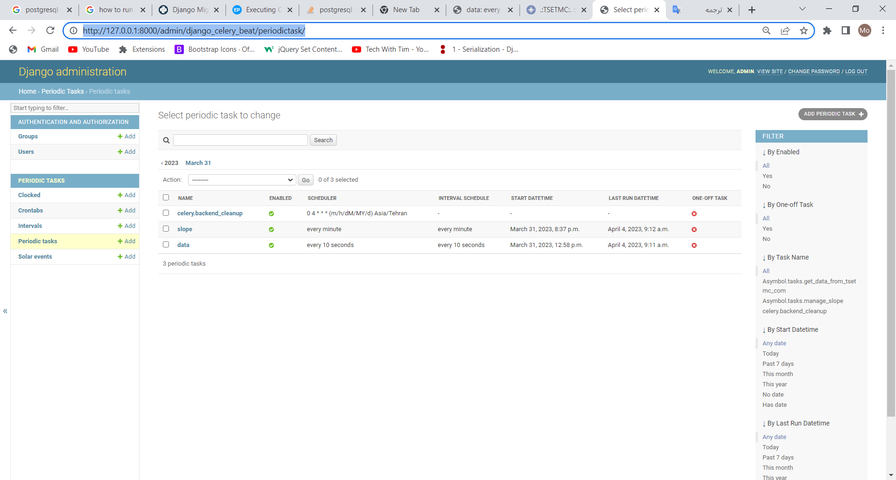
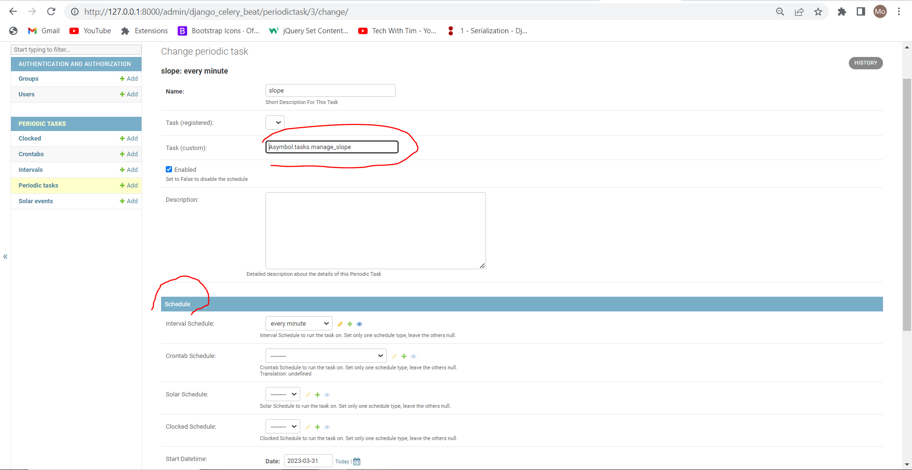

# django-table-filter

### Description

### dependency

<table>
    <tr>
        <th>
            name
        </th>
        <th>
            Ip
        </th>
        <th>
            port
        </th>
    </tr>
    <tr>
        <td>
            rabbitmq
        </td>
        <td>
            localhost
        </td>
        <td>
            5672
        </td>
    </tr>
    <tr>
        <td>
            redis
        </td>
        <td>
            localhost
        </td>
        <td>
            6379
        </td>
    </tr>
    <tr>
        <td>
            postgresql
        </td>
        <td>
            localhost
        </td>
        <td>
            5432
        </td>
    </tr>
</table>

### Quick start

run below commands:

cloning project

```
1- git clone https://github.com/KhosraviMohammad/Exchange.git
```

installing requirements

```
2- pip install -r req.txt
```

migrating:

```
3- py manage.py migrate
```

creating superuser:

```
4- python manage.py createsuperuser
```

running celery:

```
5- celery -A Exchange worker --concurrency=1 -l INFO -P eventlet
```

```
6- celery -A Exchange beat -l info
```

running project:

```
7- py manage.py runserver
```

## introducing different part of project

### tasks

there are two tasks:

- Asymbol.tasks.get_data_from_tsetmc_com
    - this one gets data from http://www.tsetmc.com/Loader.aspx?ParTree=15131F and stores them in db
- Asymbol.tasks.manage_slope
    - this one calculates slope of stored data between two ranges of datetime

how to execute tasks:

- go to http://127.0.0.1:8000/admin/django_celery_beat/periodictask/ 
- add a task which described above (e.g. Asymbol.tasks.get_data_from_tsetmc_com) with schedule you desired to set
  executing time and other options like following image:

### views

we have one api on http://127.0.0.1:8000/api/v1/symbol/slope/ that indicates measured slope with filters